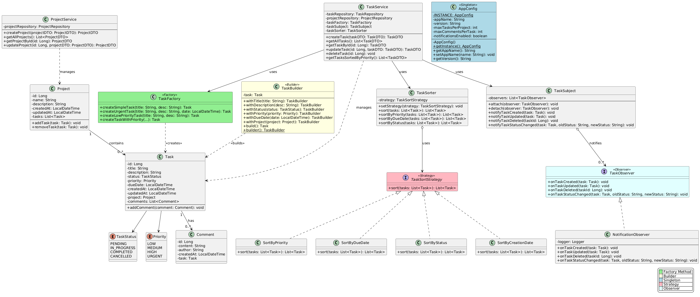

# RELATÓRIO FINAL - ANÁLISE E PROJETO ORIENTADO A OBJETOS

**Projeto**: Task Manager API  
**Grupo**: [Nomes dos integrantes]  
**Data**: Dezembro/2025

---

## 1. Introdução

### 1.1 Contexto

Este projeto consiste no desenvolvimento de um sistema de gerenciamento de tarefas e projetos...

### 1.2 Objetivos

- Aplicar 5 padrões de projeto
- Implementar API REST com Spring Boot
- Utilizar boas práticas de modelagem UML
- Verificar qualidade com SonarCloud

---

## 2. Análise e Modelagem

### 2.1 User Stories

[Ver arquivo completo: docs/user-stories.md]

As principais user stories incluem:

- US01: Gerenciar Projetos
- US02: Criar Tarefas com Prioridades (Factory Method)
- US03: Construir Tarefas Complexas (Builder)
- US04: Ordenar Tarefas (Strategy)
- US05: Receber Notificações (Observer)

### 2.2 Diagrama de Classes



**Figura 1**: Diagrama de classes mostrando as entidades principais e os 5 padrões de projeto implementados.

O diagrama apresenta:

- 3 entidades principais: Project, Task, Comment
- 5 padrões de projeto claramente identificados
- Relacionamentos entre as classes
- Interfaces e implementações

### 2.3 Diagrama de Sequência


**Figura 2**: Diagrama de sequência da US05 (Receber Notificações) demonstrando o uso do padrão Observer.

Este diagrama ilustra:

- Fluxo completo de criação de tarefa
- Notificação automática via Observer Pattern
- Atualização de status com notificações
- Interação entre camadas (Controller → Service → Repository)

### 2.4 Justificativa dos Padrões Aplicados

#### 2.4.1 Factory Method (Criacional)

**Onde**: `TaskFactory.java`  
**Justificativa**: Facilita a criação de diferentes tipos de tarefas...

#### 2.4.2 Builder (Criacional)

**Onde**: `TaskBuilder.java`  
**Justificativa**: Permite construção fluente de objetos complexos...

[Continue para os outros padrões...]

---

## 3. Implementação

### 3.1 Tecnologias Utilizadas

- Java 17
- Spring Boot 3.2.0
- SQLite
- Maven
- Lombok

### 3.2 Estrutura do Projeto

[Descrever pacotes e organização]

### 3.3 Trechos de Código Ilustrativos

#### Padrão Factory Method

```java
@Component
public class TaskFactory {
    public Task createUrgentTask(String title, String description, LocalDateTime dueDate) {
        Task task = new Task();
        task.setTitle(title);
        task.setDescription(description);
        task.setStatus(TaskStatus.PENDING);
        task.setPriority(Priority.URGENT);
        task.setDueDate(dueDate);
        return task;
    }
}
```

[Continue com exemplos dos outros padrões...]

### 3.4 Principais Decisões de Design

- Uso de DTOs para desacoplar camadas
- Repository Pattern para acesso a dados
- REST API seguindo convenções RESTful
- Validações com Bean Validation

---

## 4. Verificação de Código

### 4.1 Ferramenta Utilizada

**SonarCloud** conectado ao repositório GitHub

### 4.2 Relatórios

[INSERIR PRINTS DO SONARCLOUD]

**Figura 3**: Dashboard do SonarCloud mostrando métricas de qualidade

### 4.3 Métricas Obtidas

- **Bugs**: 0
- **Vulnerabilidades**: 0
- **Code Smells**: X
- **Cobertura**: X%
- **Duplicação**: X%

### 4.4 Issues Encontradas e Correções

1. **Issue**: [Descrever]
   - **Causa**: [Explicar]
   - **Correção**: [Como foi resolvido]

---

## 5. Contribuições da IA Generativa

### 5.1 Ferramentas Utilizadas

- ChatGPT / Claude para [especificar usos]

### 5.2 Como foi Utilizado

[Detalhar como a IA ajudou]

### 5.3 Validação dos Resultados

[Como o código gerado foi revisado e validado]

---

## 6. Conclusão

### 6.1 Reflexão

Como os padrões aplicados contribuíram para melhorar a qualidade do código?

[Sua reflexão aqui]

### 6.2 Aprendizados

[O que o grupo aprendeu]

### 6.3 Melhorias Futuras

- Implementar autenticação e autorização
- Adicionar mais testes unitários
- Implementar cache
- Criar frontend React

---

## 7. Referências

- GAMMA, Erich et al. **Padrões de Projeto**: Soluções reutilizáveis de software orientado a objetos. Bookman, 2000.
- Spring Framework Documentation. Disponível em: https://spring.io/
- [Outras referências utilizadas]
